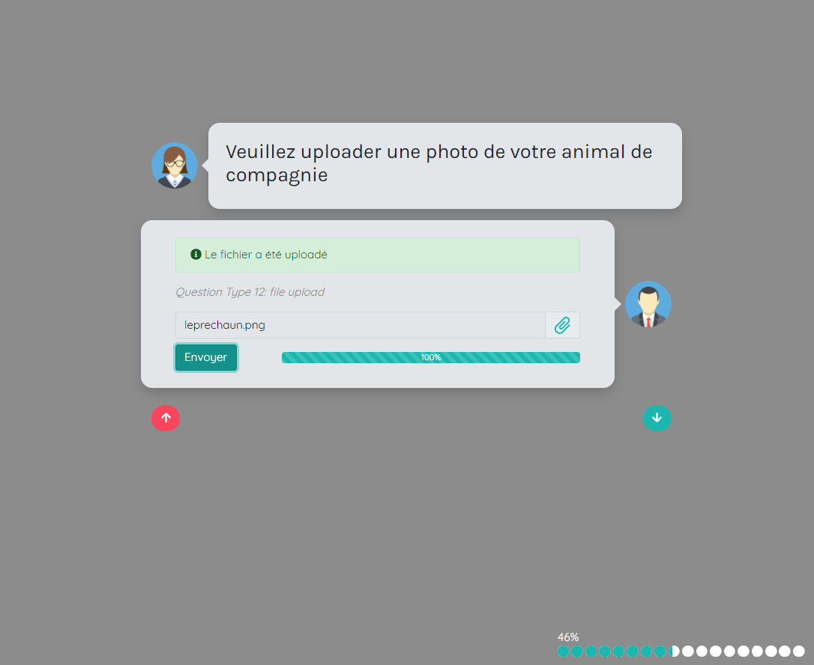

# Survey Wizard

## Présentation du Projet

Projet créé par [**Kevin Labtani**](https://github.com/kevin-labtani) dans le cadre de mon stage chez [Hike-Up](https://hike-up.be/) de début avril à fin juillet 2020.

Le but du projet est de développer la partie front-end utilisateur d'une application d'enquêtes en ligne équivalent à Typeform mais répondant aux besoins spécifiques de Hike-Up. L'outil de création d'enquêtes et le back-end sont gérés de manière séparée à cette application.

nb: J'ai l'autorisation de partager le code à des fins non commerciales.

## Fonctionnalités de l'Application

15 questions type sont implémentés:

- **MultipleChoice** pour les questions à choix multiples.
- **SingleChoice** pour les questions à choix unique.
- **YesNo** pour les questions de type oui-non ou vrai-faux.
- **Legal** pour les questions oui-non de type légal.
- **Rating** pour les questions de type évaluation.
- **ShortText** pour les questions de type textes courts.
- **OpinionScale** pour les questions de type opinion.
- **Email** pour les questions de type email.
- **Number** pour les questions de type nombre.
- **PhoneNumber** pour les questions de type numéro de téléphone.
- **LongText** pour les questions de type textes longs.
- **FileUpload** pour les questions de type upload de fichier.
- **Welcome** pour la première page du questionnaire (à usage unique).
- **ThankYou** pour la dernière page du questionnaire (à usage unique).
- **Recap** pour présenter une récapitulation des réponses et soumettre le questionnaire (à usage unique).

### Fonctionnalités Générales de l'Application

Le temps (en secondes) passé par l'utilisateur sur chaque question est enregistré et envoyé au back-end lors de la soumission des réponses.

Les données suivantes sont extraites du browser de l'utilisateur et envoyées au back-end lors de la soumission des réponses: nom du browser, useragent du browser, langue préférée de l'utilisateur, plateforme de l'utilisateur (eg. windows), referrer, et dans le cas où l'utilisateur est sur un mobile: type d'appareil mobile (gsm ou tablette) et OS du mobile.

Un mode de soumission partielle est implémenté, si l'utilisateur quitte le questionnaire sans soumettre ses réponses, un appel vers le back-end est effectué pour enregistrer l'id de la dernière question répondue, l'id du questionnaire et l'id assigné à l'utilisateur.
De plus, les données nécessaires à la reprise en cours du questionnaire sont enregistrées en `localStorage`, l'utilisateur a donc la possibilité lors d'une session ultérieure de reprendre le questionnaire là où il en était si il le souhaite, cette option lui sera automatiquement présentée lors qu'il rechargera le questionnaire.

Le support multi-langues est implémenté, toute les strings statiques non dépendantes des questions (eg. messages d'erreur, placeholders) sont récupérées du back-end par la route pour les options de configuration.

### Fonctionnalités spécifiques aux questions

Veuillez vous référer à la variable `initialState` du fichier [`QuestionsState.js`](./src/context/questions/QuestionsState.js) pour une exemple d'implémentation de chaque question type. Une description des fonctionnalités notables suit.

Toutes les questions type sauf les questions type **Welcome**, **ThankYou** & **Recap**:

- peuvent être rendues obligatoires ou optionnelles par la clé `question_required`; les questions obligatoires sont marquées par une `*` après le titre de la question.
- ont la possibilité d'intégrer une image dans la bulle question, en dessous du titre de la question, par la clé `question_picture`. [(Exemple visuel)](./readme-assets/questionpicture.png)
- ont la possibilité d'avoir un `avatar_answer` et un `avatar_question` différent par question, par les clés du même nom.
- une validation est implémentée spécifiquement question type par question type (eg. un email valide doit être entré pour la question type email où un message d'erreur sera affiché à l'utilisateur).

Les questions présentant un choix unique (**YesNo**, **Legal**, **SingleChoice**, **OpinionScale**) ont la possibilité d'implémenter une navigation conditionnelle dans le questionnaire, sur base du choix effectué, en passant une `question_id` valide à la clé `next_id_if_selected` (qui va passer outre la clé par défaut `default_next_id`) de chaque choix (`box_values`) pour les quatre questions sus-citées.

Les questions type **SingleChoice** & **MultipleChoice**:

- acceptent un paramètre optionnel `other` permettant une réponse libre de l'utilisateur. [(Exemple visuel)](./readme-assets/freetext.png)
- acceptent un paramètre optionnel `picture` permettant l'affichage d'une image pour chaque choix, avec ou sans `label`, pour autant qu'une clé `picture` soit présente pour chaque choix (`box_values`).

## Installation de l'Application

`npm install` pour installer les dépendance
`npm start` pour lancer l'application en mode développement

Cette application étant créée par `create-react-app`, veuillez vous référer à leur [documentation](https://create-react-app.dev/docs/getting-started/) pour plus de détails.

## Exigences d'implémentation relatif à l'API back-end

Cette application est dépendante d'une API REST fournissant les routes suivantes:

- Route GET pour récupérer les questions au niveau de la fonction `getQuestions` du fichier [`QuestionState.js`](./src/context/questions/QuestionsState.js). Une implémentation de chaque question type est fournie dans l'`initialState` de ce même fichier.
- Route GET pour récupérer les options de configuration au niveau de la fonction `getConfig` du fichier [`ConfigState.js`](./src/context/config/ConfigState.js) Une implémentation type est fournie dans l'`initialState` de ce même fichier.
- Route POST pour envoyer les réponses au niveau de la fonction `sendAnswer` du fichier [`Form.js`](./src/components/Form.js). La réponse est construite par la fonction `constructAnswer`; alternativement, vous pouvez décommenter le `console.log(data);` dans la fonction `sendAnswer` et soumettre un questionnaire rempli (soumission par la question type **Recap**), ce qui vous permettra d'avoir dans la console l'objet envoyé en réponse à l'API.
- Route POST pour gérer une soumission partielle du questionnaire au niveau de la fonction `window.onbeforeunload` du fichier [`Form.js`](./src/components/Form.js). Lorsqu'un utilisateur quitte prématurément le questionnaire, l'application envoie par la méthode `sendBeacon` de l'API Web `Navigator` une requête vers la route `https://url/to/api/${responseUuid}/false/${lastLocation}/${assessmentId}` pour informer le back-end du fait qu'un utilisateur a quitté le questionnaire sans le soumettre avec l'id de la dernière réponse atteinte par l'utilisateur (lastLocation), l'id du questionnaire (assessmentId) et l'uuiid assigné à cet utilisateur (responseUuid).
- Route POST (Content-Type: multipart/form-data) pour envoyer des fichiers (eg. images ou pdf) au niveau de la fonction `uploadHandler` du fichier [`FileUpload.js`](./src/components/questionType/FileUpload.js) pour la question type FileUpload.

## Structure du Projet

- `src/components` contient

  - un sous-dossier pour les Composants React de layout.
  - un sous-dossier pour les Composants React implémentant les 15 questions type.
  - le Composant React ErrorPage qui sera rendu à l'écran si l'une des deux requêtes GET (pour récupérer les questions et les options de configurations) rencontre un problème.
  - le Composant React principal `Form`. L'état relatif aux réponses et aux timings de réponse est géré à ce niveau.

- `src/context` contient trois sous-dossiers pour les trois Contextes React implémentés, un pour les questions, un pour les alertes et un pour la configuration. Les implémentations sont basées sur le [Flux Pattern](https://facebook.github.io/flux/)

## Remarques & Améliorations possibles

J'ai choisi d'utiliser bootstrap en tant que module npm plutôt que d'utiliser une librairie de Composants React tel que [React Bootstrap](https://react-bootstrap.netlify.app/) ou [reactstrap](https://reactstrap.github.io/) dû au degré de personnalisation nécessaire (eg. les boutons pour les questions type à choix unique ou multiple sont en fait des labels stylisés pour ressembler à des boutons), je pense qu'utiliser une librairie de Composants aurait rendu la tâche plus compliquée. De plus je n'utilise que la partie css de bootstrap, je n'importe pas les dépendances js dans l'application.

Je devais assurer la rétrocompatibilité avec les systèmes existant au niveau du back-end (en PHP) et de la database, ce qui explique le format parfois particulier dans lequel je récupère (/et renvoie) les données depuis (/vers) l'API.  
Aussi pour raison de rétrocompatibilité, les Composants implémentant les questions type **Legal** et **YesNo** sont fonctionnellement identiques.

J'ai implémenté un système d'alertes pour les erreurs, et effectue la validation "à la main" plutôt que d'utiliser `formik` ou `react-hook-form` car j'avais confiance en ma capacité à délivrer une application fonctionnelle en codant cette partie à la main alors que je n'étais pas sûr de pouvoir adapter `formik` à mon cas d'utilisation particulier.  
Cela dit, la création d'un custom hook et l'utilisation de `useReducer` plutôt que du `useState` pour gérer les réponses et les timings m'aurait permis d'extraire une partie de la logique hors du Composant `Form` et aurait rendu celui-ci plus lisible.

Certains des Composants implémentant les questions type sont relativement lourds, il devrait être possible d'extraire un Composant `Input` paramétrable qui permettrait de réduire la duplication de code d'un Composant à l'autre.

## Contributeur

- [**Kevin Labtani**](https://github.com/kevin-labtani)

## Technologies

- React par `create-react-app`, avec les packages `react-router-dom` pour le routing et `framer-motion` pour les animations.
- Axios pour les requêtes http.
- Bootstrap + Sass.
- Font Awesome pour les icônes.

code formaté par `prettier` et linté par `eslint`.

## Progression

Projet terminé le 17 juillet 2020 suite à la fin de mon stage.

## Remerciements

- Christophe Masse, Sébastien Archambeau & Dominique Pellegrino de chez [Hike-Up](https://hike-up.be/) pour l'opportunité de prester mon stage chez eux.
